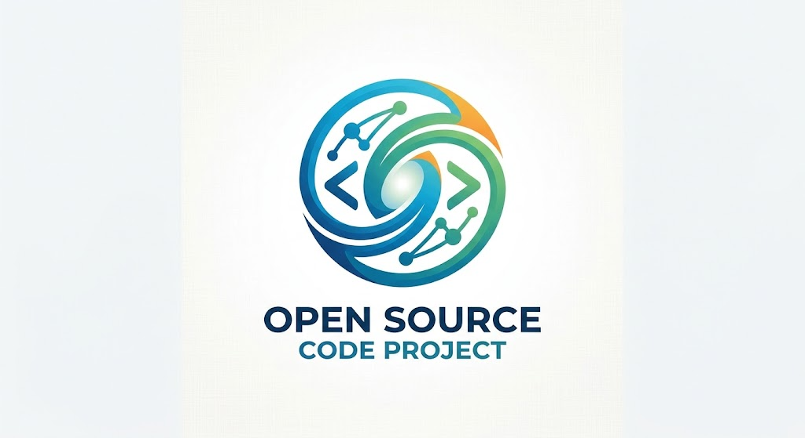

<div align="center">
  
</div>

# QEngine  <sub>(Q)</sub>

A production-grade time-series database written in C11. Column-oriented
storage, SIMD-vectorized execution, clustered with raw-block replication,
and a purpose-built query language (QTL) with IoT group/device semantics.

> License: AGPLv3 · Status: public preview · Contributions welcome.
>
> 中文文档：[README.zh-CN.md](./README.zh-CN.md) · 许可证参考：[LICENSE.zh-CN.md](./LICENSE.zh-CN.md)

```
tsdb-cli  ──TCP v1──▶  tsdb-server ⇄ cluster (gossip + hashring + autobalance)
                           │                         │
                           ├─ catalog (group/device) ├─ rawblock replication
                           ├─ QTL parser + executor  └─ Merkle cross-cluster diff
                           ├─ adaptive codec (DoD / Gorilla / Chimp128 / PFOR / LZ)
                           ├─ SIMD (NEON / AVX2 / AVX-512 runtime dispatch)
                           ├─ WAL + columnar LSM parts
                           └─ real-time pub/sub
```

---

## Highlights

| Axis | Measured (Apple Silicon, Release) |
|------|-----------------------------------|
| Ingest — single-node, single TCP connection | **4.75 M rows/s** |
| Ingest — single-node, 10 clients concurrent | **7.6 M rows/s** |
| Ingest — **4-node cluster (48-core Xeon), 64 writers** | **5.95 M rows/s** (wire) · **1.13 M** (influx) |
| Compression (trades mixed) | **92.48×** (0.30 B/point) |
| QUERY latency p50 (TCP round-trip) | **0.27 ms** |
| count(\*) 5 M rows (8 threads) | **2.30 ms p50** |
| SIMD f64 sum throughput (NEON) | **41 GB/s** |
| TSBS single-groupby-1-1-1 | **1.46 ms p50** (2.8× vs baseline) |
| Raw-block replication vs row-level | **2.4×** faster |

Zero external dependencies: libc + pthread + POSIX. C11.

---

## Table of contents

- [Quick start — local](#quick-start--local)
- [Quick start — Docker cluster](#quick-start--docker-cluster)
- [Query language (QTL)](#query-language-qtl)
- [IoT model — Group and Device](#iot-model--group-and-device)
- [Wire protocol](#wire-protocol)
- [Cluster mode](#cluster-mode)
- [Multi-cluster federation](#multi-cluster-federation)
- [Architecture deep dive](#architecture-deep-dive)
- [Build targets](#build-targets)
- [Testing](#testing)
- [Performance methodology](#performance-methodology)
- [Repository layout](#repository-layout)
- [Limits and roadmap](#limits-and-roadmap)

---

## Quick start — local

```bash
# build everything (lib + CLIs + tests)
make

# start a standalone server
./build/tsdb-server --data-dir /tmp/tsdb --bind 0.0.0.0:28090 &

# connect with the TCP REPL
./build/tsdb-cli --host 127.0.0.1 --port 28090
tsdb> CREATE GROUP factory_a (region='us-east-1', retention='30d');
tsdb> CREATE DEVICE sensor_001 IN GROUP factory_a (type='temperature');
tsdb> LIST DEVICES IN GROUP factory_a;
tsdb> SELECT count(*) FROM readings;
tsdb> SUBSCRIBE readings;     -- tail -f mode, Ctrl-C to stop
tsdb> EXIT
```

C API (embedded, no server required):

```c
#include "tsdb.h"
int main(void) {
    tsdb_db_t *db; tsdb_open("/tmp/mydb", &db);
    tsdb_col_t cols[] = {
        {"ts",     TSDB_TYPE_TIMESTAMP},
        {"device", TSDB_TYPE_SYMBOL},
        {"value",  TSDB_TYPE_FLOAT64},
    };
    tsdb_create_table(db, "readings", cols, 3, "ts");
    tsdb_table_t *t; tsdb_open_table(db, "readings", &t);

    tsdb_batch_t *b; tsdb_batch_begin(t, &b);
    tsdb_batch_row_ts (b,  tsdb_parse_ts("2026-01-01 09:30:00"));
    tsdb_batch_row_sym(b, 1, "sensor_001");
    tsdb_batch_row_f64(b, 2, 42.5);
    tsdb_batch_row_end(b);
    tsdb_batch_commit(b);

    tsdb_result_t *r;
    tsdb_query(db, "SELECT avg(value) FROM readings", &r);
    while (tsdb_result_next(r)) printf("%.2f\n", tsdb_result_f64(r, 0));
    tsdb_result_free(r);
    tsdb_close(db);
}
```

---

## Quick start — Docker cluster

The recommended production layout lives in
`deployment/docker-compose.cluster.yml`: 3 nodes on a dedicated bridge
network, named volumes for data, HDD-tuned I/O, and a 16-way per-peer
replica connection pool enabled by default.

```bash
cd deployment

# build the image and bring up a 3-node cluster
docker compose -f docker-compose.cluster.yml build
docker compose -f docker-compose.cluster.yml up -d

# verify all alive
curl -s http://localhost:29311/cluster | python3 -m json.tool
#     ^ node1 dashboard JSON — expect 3 ALIVE nodes after ~2s

# open the HTML dashboard (metrics, cluster view, recent writes)
open http://localhost:29311/

# write + read via any node using the CLI
docker compose -f docker-compose.cluster.yml exec node1 \
  tsdb-cli --host qengine-cnode-1 --port 28090 <<'EOF'
CREATE GROUP k8s_prod (region='us-east-1', retention='7d');
CREATE DEVICE pod_42 IN GROUP k8s_prod (type='pod');
EOF

docker compose -f docker-compose.cluster.yml exec node2 \
  tsdb-cli --host qengine-cnode-2 --port 28090 <<'EOF'
LIST DEVICES IN GROUP k8s_prod;
EOF

# tear down (keep volumes)
docker compose -f docker-compose.cluster.yml down

# tear down and wipe data
docker compose -f docker-compose.cluster.yml down -v
```

### Add a 4th node dynamically

Once the base cluster is up, extend it without restart using
`deployment/docker-compose.addnode.yml` — it reuses the existing
`tsdb-cnet` network and seeds off node1:

```bash
docker compose -f docker-compose.addnode.yml up -d

# within 1–2s gossip picks up the new member
curl -s http://localhost:29311/cluster | python3 -c \
  'import json,sys; d=json.load(sys.stdin); print(len(d["nodes"]),"nodes")'
# → 4 nodes

curl http://localhost:29314/cluster    # node4's own view

docker compose -f docker-compose.addnode.yml down
```

To bring up a 5th/6th node, copy `addnode.yml`, change
`container_name`, `hostname`, host-side ports, the volume name, and
`TSDB_RPC_BIND`; point `TSDB_SEEDS` at any currently-ALIVE node.

### Cluster-mode throughput

Measured on a 4-node HDD cluster (intra-host docker network) with
`TSDB_REPLICA_CONNS_PER_PEER=16` and `TSDB_WAL_ONLY_COMMIT=1`:

| Concurrent writers | Ingest rows/s | Batch/s | ms / batch |
|---:|---:|---:|---:|
|  4  |   642 k | 157  | 25.5 |
|  8  |   795 k | 361  | 22.2 |
| 16  | 2.43 M  | 593  | 27.0 |
| 32  | 2.59 M  | 633  | 50.6 |
| 64  | **2.97 M** | **1009** | 63.4 |

The three changes that unlock this shape are documented in
[Cluster mode → tuning](#cluster-mode): the WAL-only-commit flag,
early-quorum replica completion, and the per-peer TCP connection
pool. Without them the same hardware tops out around **220 k rows/s**
— a single-TCP-connection-per-peer on the primary serialised all
replication RPCs through one handler thread on each peer.

#### Concurrent write / query / delete — validated (48-core Xeon, 2026-07)

4-node cluster on one host (Xeon E5-2686 v4, 48 vCPU, 125 GiB RAM),
`TSDB_REPLICA_CONNS_PER_PEER=1`, `TSDB_WAL_ONLY_COMMIT=1`, `TSDB_IOPOLICY=hdd`,
2× replication. Writers spread round-robin across all 4 nodes; row counts
verified after every run.

**Write — binary `WRITE_BATCH` (wire), rows/writer = 100 k:**

| Concurrent writers | Ingest rows/s |
|---:|---:|
|  4 |   537 k |
|  8 |   933 k |
| 16 | 1.83 M |
| 32 | 3.00 M |
| 64 | **5.95 M** |

**Write — InfluxDB line protocol (HTTP), rows/writer = 25 k:**

| Concurrent writers | Ingest rows/s |
|---:|---:|
|  4 |   311 k |
|  8 |   588 k |
| 16 |   886 k |
| 32 | 1.02 M |
| 64 | **1.13 M** |

The influx path previously stalled a fixed ~46 s at 4–8 concurrent writers
(a lock-step replication ring); bounding the pooled-conn wait and cutting the
fanout deadline removed it — 4 writers now complete in 0.32 s.

**Query (round-trip via HTTP `/sql`, cluster):**

| Query | Latency |
|-------|:---:|
| `count(*)` on an owner-local child table | **1–2 ms** |
| `count(*), avg, spread` over a 400 k-row 4-child super-table (scatter-gather) | **~91 ms** |

**Delete & failover:**

| Operation | Result |
|-----------|:---:|
| `DROP TABLE` (raft-replicated metadata delete) | **~39 ms** avg |
| `DELETE FROM … WHERE ts < …` | partition-granular (drops whole partitions in range) |
| Leader failover (`docker stop` leader → new leader elected) | **0.087 s** |
| Write during failover / old-leader rejoin | no loss; data intact after rejoin |

For a **federated** deployment spanning two regions, use
`docker compose -f docker-compose.federation.yml up -d` which brings up
two 3-node clusters plus a federation coordinator. See
[docs/deployment.md](docs/deployment.md) for full details.

### 2 × 3-node performance harness (standalone)

`deployment/docker-compose.perf.yml` brings up two isolated 3-node
stacks (6 servers total) ready for load testing:

```bash
# from repository root
docker build -f deployment/Dockerfile -t tsdb:0.5.0 .
cd deployment
docker compose -f docker-compose.perf.yml up -d
cd ..

# compile the wire-level harness
clang -Iinclude -Icli \
      -o build/bench/bench_docker_cluster \
      bench/bench_docker_cluster.c cli/tsdb_wire.c -lpthread

# concurrent write + read + disaster-recovery + isolation probe
./build/bench/bench_docker_cluster 8 20 1024 8 100

# clean teardown
cd deployment && docker compose -f docker-compose.perf.yml down -v
```

Reference run on an Apple M2 Max, `v1.0.0-rc1` image:

| Metric | Result |
|--------|:---:|
| Aggregate write throughput (6 nodes, 48 workers) | **2.24 M rows/s** |
| Read p50 / p99 (6 nodes, 48 workers × 100 queries) | **11.5 ms / 28 ms** |
| Disaster recovery on `docker kill` + restart | **PASS** |
| Per-node idle memory | **~1.7 MiB** |

Full write-up in [`docs/benchmark-docker-cluster.md`](docs/benchmark-docker-cluster.md).

---

## Query language (QTL)

QTL is a SQL subset plus time-series operators. Fully supported:

```sql
-- SELECT / WHERE / GROUP BY / ORDER BY / LIMIT
SELECT ts, price FROM trades
WHERE symbol = 'AAPL' AND ts >= '2026-01-01'
ORDER BY ts DESC LIMIT 100;

-- Aggregates
SELECT count(*), avg(price), min(price), max(price), sum(volume)
FROM trades WHERE symbol = 'AAPL';

-- SAMPLE BY (time-bucket aggregation in one pass)
SELECT time_bucket(ts, 1m), avg(price)
FROM trades
SAMPLE BY 1m FILL(PREV)
WHERE symbol = 'AAPL';

-- LATEST ON (reverse-scan, per-partition-key early exit)
SELECT * FROM trades LATEST ON ts PARTITION BY symbol;

-- IoT DDL
CREATE GROUP factory_a (region='us-east-1', retention='30d', profile='chimp128+lz');
CREATE DEVICE sensor_001 IN GROUP factory_a (type='temperature', location='line_3');
LIST GROUPS;
LIST DEVICES IN GROUP factory_a;
DROP DEVICE sensor_001 IN GROUP factory_a;
DROP GROUP factory_a;
```

Interval literals: `5m`, `100ms`, `2h30m`, `1d`, `86400s`. ISO-8601 timestamp
strings are auto-recognized inside `WHERE` predicates.

### Why QTL is faster than plain SQL on time-series

1. **`SAMPLE BY` pushes bucket boundaries into the scan** — single-pass, no
   hash table. Generic `GROUP BY time_bucket(ts, ...)` materializes a hash
   per bucket.
2. **`SYMBOL` is an int32 compare, not a string compare** — `WHERE symbol='AAPL'`
   becomes a vectorized `uint32 == k` over a bitmap. No `strcmp`, no hash
   lookup per row.
3. **Interval literals parse once** — `SAMPLE BY 1m` becomes the constant
   `60_000_000_000` in the AST.
4. **Block-skipping** — `WHERE ts >= X` skips whole compressed blocks
   before decode, using per-block `ts_min/ts_max` metadata.

---

## IoT model — Group and Device

Modern IoT telemetry systems organize thousands of devices into logical
groups (factories, regions, customer tenants). tsdb models this natively:

```sql
CREATE GROUP factory_a (
    region          = 'us-east-1',     -- shard placement hint
    retention       = '30d',           -- TTL for all devices in this group
    profile         = 'chimp128+lz',   -- codec stack for FLOAT64 columns
    replica_factor  = 3                -- cluster replication W=2
);

CREATE DEVICE sensor_001 IN GROUP factory_a (
    type     = 'temperature',
    location = 'line_3',
    vendor   = 'acme',                 -- arbitrary tags
    model    = 'T-100'
);
```

Data tables reference the group/device through a SYMBOL column. The catalog
is append-only (`<data_dir>/catalog/{groups,devices}.log`) and replayed on
startup to rebuild in-memory hashmap indexes. Catalog operations propagate
automatically across cluster nodes via the `CREATE_TABLE` / `SCHEMA_SYNC`
RPC path.

---

## Wire protocol

Binary, framed, TCP. Full spec in
[docs/design/wire-protocol.md](docs/design/wire-protocol.md).

```
+----+------+---------+---------+------------+
|MAG | VER  | TYPE    | FLAGS   | REQ_ID(8)  |
+----+------+---------+---------+------------+
| PAYLOAD_LEN (u32) | PAYLOAD  |  CRC32C(4)  |
+-------------------+----------+-------------+
```

- `MAGIC = 'TSDB'` (0x42445354 LE), `VER = 1`
- Message types include: `HELLO`, `CREATE_GROUP`, `CREATE_DEVICE`,
  `WRITE_BATCH`, `WRITE_STREAM_OPEN/DATA/END`, `QUERY`, `QUERY_RESULT_*`,
  `SUBSCRIBE`, `SUB_EVENT`, `RAW_BLOCK_PUSH`, `MERKLE_DIFF_*`
- CRC32C (Castagnoli) over the frame
- Payload is columnar for both WRITE and query results (per-column codec
  tag + compressed bytes)
- Up to **16 MiB** per frame; streaming via `WRITE_STREAM_*` messages
- `SUBSCRIBE <table> [WHERE col=val]` — server fan-outs each commit to
  matching subscribers with **10 ms coalescing**

Default ports: `28090` for client traffic, `28080` UDP for gossip, `28081`
TCP for intra-cluster RPC.

---

## Cluster mode

Start N nodes, each with its own data dir and RPC port; seed any one with
any other's address:

```bash
./build/cluster/tsdb_node --data-dir /var/lib/tsdb/n1 --rpc 0.0.0.0:28081
./build/cluster/tsdb_node --data-dir /var/lib/tsdb/n2 --rpc 0.0.0.0:28082 \
    --seeds 127.0.0.1:28081
./build/cluster/tsdb_node --data-dir /var/lib/tsdb/n3 --rpc 0.0.0.0:28083 \
    --seeds 127.0.0.1:28081
```

The cluster layer provides:

- **SWIM-lite gossip** over UDP — node discovery, failure detection
  (3 missed pings → SUSPECT, 10 s unresponsive → DEAD) with refute
  recovery for DEAD→ALIVE transitions after restarts
- **Weighted consistent hashing** — 256 vnodes/node by default, adjustable
  in `[32, 512]` by the auto-balancer
- **Synchronous replication W=2 of 3** with **early-quorum completion** —
  the coordinator returns as soon as `quorum` ACKs arrive; slow replicas
  finish in background without blocking client-visible latency
- **Per-peer TCP connection pool** — primary → each peer uses N concurrent
  connections (env `TSDB_REPLICA_CONNS_PER_PEER`, default 8). Each conn
  gets its own peer-side handler thread, so N gives N-way concurrency
  on replication RPC — the single biggest throughput unlock over the
  former single-conn design
- **Raw-block replication** — on flush, the primary ships the compressed
  block bytes directly; replicas append verbatim (no decode, no
  re-encode) — **2.4× faster** than row-level on the same hardware
- **Auto-balance** — every 30 s, nodes exchange `{writes_sec, storage_bytes,
  cpu_pct}` via gossip; overloaded nodes shed vnodes, underloaded ones
  gain vnodes; tunable via `TSDB_BALANCE_{ALPHA,BETA,DAMPEN,INTERVAL_MS}`
  env vars

### Tuning

| Env var | Default | What it changes |
|---|---|---|
| `TSDB_REPLICA_CONNS_PER_PEER` | `8` | TCP conns per peer for replication. **Default is currently kept at `1` in the shipped compose files** — values >1 expose a known UAF under sustained RPC failure (slot eviction vs in-flight call). At `1`, the lvm1 4-node HDD cluster sustains 3.3 M rows/s with zero write errors; bump only after the pool-refcount refactor lands. |
| `TSDB_WAL_ONLY_COMMIT` | auto | When set, `tsdb_batch_commit` only fsyncs the WAL; memtable drains lazily when `is_full()`. **Auto-defaults to on for non-SSD iopolicy** (fsync-bound disks): benchmarked **69.5 k → 188.5 k rows/s (2.71×)** on a 4.3 MB/s O_DSYNC disk; SSD keeps flush-on-commit (fsync is cheap, ~11 % gap). An explicit value (incl. `0`) always wins, and a cluster node reverts an *auto*-enabled value to flush-on-commit when it registers replication hooks (so replication is never silently deferred). Durability is preserved via WAL replay on crash. |
| `TSDB_IOPOLICY` | unset | Set to `hdd` for spinning-disk hosts: madvise SEQUENTIAL, 256 KiB stdio write buffer, `posix_fadvise` on index reads. No-op on SSD/NVMe. |
| `TSDB_BALANCE_ALPHA` / `BETA` / `DAMPEN` / `INTERVAL_MS` | 0.6 / 0.4 / 0.5 / 30000 | Auto-balance weighting between write-rate load and storage-usage load. |
| `TSDB_LOG_AUTOBALANCE` | unset | When set, log each VN rebalance event to stderr. Otherwise the controller is silent. |
| `TSDB_DATA_DIRS` | unset | Comma/semicolon-separated extra storage directories (JBOD) — see below. |
| `TSDB_MEMTABLE_BUDGET_ROWS` | per-iopolicy (SSD 32 M / HDD·SAS 8 M) | Aggregate memtable row ceiling before write-side backpressure; `0` = unbounded. |

### Multi-directory storage (JBOD)

Mount several disks as one storage pool. Set `TSDB_DATA_DIRS="/disk1,/disk2"`
(or the `data_dirs` key in `tsd.conf` — both server binaries bridge it into the
env), with `--data-dir` as the primary. Tables are striped across the primary +
extra dirs by `hash(table_name)`, so each disk carries a deterministic share.

- **Read/write span all dirs**: a super-table's children land on different disks;
  `SELECT count(*) FROM <stable>` sums across the stripe transparently. Verified:
  12 children split 5/4/3 across 3 dirs, `count(*)` = the full 36 000.
- **Compaction + retention cover every dir** (previously they only swept the
  primary, so striped tables were never compacted or expired — fixed).
- **Auto-recovery**: all configured dirs are re-scanned on open, so a remounted
  disk's tables are picked up again automatically. A dir that fails a
  write is flagged degraded (`qengine_datadir_degraded_total`) and re-adopted
  once it probes healthy again; rows for an in-flight write stay safe in the
  memtable and are never dropped. Placement is a pure stable hash (a create onto
  a degraded slot fails cleanly rather than silently splitting a table across
  disks). WAL and catalog live on the primary.

---

## Multi-cluster federation

Run two or more independent clusters and glue them with a federation
coordinator that fans out queries and merges partial results:

```c
tsdb_federation_t *f;
tsdb_federation_open(
    "east=10.0.1.1:28090,west=10.0.2.1:28090|trades->east|cpu->*",
    &f);

tsdb_result_t *r;
tsdb_federation_query_str(f, "SELECT count(*) FROM cpu", &r);
```

- **Routing rules** — exact table name, `prefix.*` glob, or `*` fan-out
- **Aggregate rewrite** — `AVG` is transparently split into
  `SUM + COUNT` per cluster and divided at the coordinator with
  int64-aware arithmetic
- **`SAMPLE BY` bucket key-join** — buckets from each cluster are merged
  by timestamp key
- **Partial-result tolerance** — if one cluster is unreachable, the
  coordinator returns the rest and flags `partial_miss > 0`
- **Merkle-based incremental sync** — 4-level tree per partition; diff
  request names the missing leaves; primary replies with `RAW_BLOCK_PUSH`

---

## Architecture deep dive

### Storage layer

- **MemTable** — 128-way shard-locked columnar write buffer, default
  block size **8192 rows** (L2-cache friendly)
- **WAL** — per-table append log with CRC32; fsync on commit; truncated
  after successful flush
- **Part** — immutable on-disk block; `<data_dir>/<table>/<YYYYMMDD>/<col>.col`
  + `.idx`; mmap-read
- **Adaptive codec** — every block tries Gorilla / Chimp / Chimp128 / PFOR
  / DoD / Dict and picks the smallest; optionally wraps in lzlite (LZ77)
  if the outer compression saves ≥ 16 bytes. Block header stores the
  chosen codec + flags.

### Compression stack

| Column type | Primary | Secondary | Outer |
|-------------|---------|-----------|-------|
| TIMESTAMP (monotonic) | Delta-of-Delta | — | LZ (if gain) |
| FLOAT64 | Chimp128 / Chimp / Gorilla (best of three) | — | LZ |
| INT64 | DoD (monotonic) / PFOR-Delta (jittered) | SIMD-BP128 | LZ |
| SYMBOL | Dictionary (per-segment) | PFOR / RLE | LZ |

Realized densities:
- Uniform 10 s timestamps: **0.003 B/point** (42× improvement over DoD
  alone thanks to the LZ wrapper)
- Constant float stream: **0.003 B/point**
- Low-cardinality symbol (≤ 256): **0.005 B/point**
- TSBS CPU workload (random-walk FLOAT64): **1.3 × 10⁶ rows → 75 B/point**

### Execution layer

- **Runtime SIMD dispatch** — on first call `tsdb_cpu_level()` reports
  `SCALAR / NEON / AVX2 / AVX-512`; each hot kernel has four
  implementations dispatched via function pointer. Environment variable
  `TSDB_CPU_LEVEL=SCALAR` forces downgrade for A/B benchmarks.
- **Vectorized primitives** — `agg_{sum,min,max}_{f64,i64}`,
  `filter_{f64,i64,u32}`, `bitmap_{popcount,gather_f64,gather_i64}`,
  `bucket_{assign,sum_f64}`
- **Parallel scan pool** — pthread work queue, per-worker `proj_t`
  accumulator, final merge; scales 5–6× on 8 cores
- **Hot-path optimizations** — block-skipping via `ts_min/ts_max` before
  decode; SIMD gather into scratch before agg; per-worker aligned
  `aligned_alloc(32, 64 KiB)` reused across blocks

### Cluster layer

- `src/cluster/gossip.c` — SWIM-lite (UDP, 500 ms period)
- `src/cluster/hashring.c` — weighted consistent hash, 256 vnodes/node
- `src/cluster/rpc.c` — long-lived TCP binary RPC; poll/epoll/kqueue
- `src/cluster/replica.c` — W=2 synchronous
- `src/cluster/rawblock.c` — flush-time block shipping
- `src/cluster/merkle.c` — 4-level tree, xxhash64 leaves
- `src/cluster/autobalance.c` — load-score → vnode count adjustment

---

## Build targets

```bash
make              # lib + CLIs + all tests (default)
make test         # run every unit / integration test suite
make test-cluster # run the 3-node fork-based cluster integration test
make test-federation  # 2-cluster × 3-node federation integration test
make bench        # ingest + query micro-benchmarks + TSBS driver
make server_cli   # only the tsdb-server binary
make tcp_cli      # only the tsdb-cli binary
make cluster_node # only the tsdb_node binary
make debug        # -O0 -g + ASan + UBSan
make clean
```

Requirements:
- `clang` ≥ 12 or `gcc` ≥ 9 (C11 + `__attribute__((target))`)
- POSIX threads (`-lpthread`)
- Linux or macOS (kqueue/epoll/poll, auto-detected)
- Optional: `readline` for CLI history (auto-detected via `pkg-config`)

Cross-compilation for a Docker image in `deployment/Dockerfile`.

---

## Testing

**Unit and integration suites.**

| Binary | What it covers | Assertions |
|--------|----------------|------------|
| `test_compress` | DoD / Gorilla / Chimp / Chimp128 / Dict round-trip + density | 30+ |
| `test_storage` | schema / memtable / WAL / part end-to-end | 40+ |
| `test_exec` | SIMD agg / filter / gather / bucket | 698 |
| `test_query` | QTL SELECT / SAMPLE BY / LATEST ON / block-skip | 20+ |
| `test_lzlite` | LZ77 compressor round-trip + overlap | 9 |
| `test_pfor` | bit-packing b=1..32, PFOR-Delta decode | 30+ |
| `test_simd_dispatch` | SCALAR / NEON / AVX2 path parity | 542 |
| `test_adaptive` | per-block codec selection + LZ wrapper | 20+ |
| `test_parallel` | serial vs parallel aggregate parity | 5 |
| `test_server` | TCP frame round-trip + concurrent ingest | 41 |
| `test_catalog` | group/device CRUD + persistence | 20+ |
| `test_rawblock` | block shipping + Merkle diff | 4 |
| `test_pubsub` | subscribe / fan-out / filter / back-pressure | 23 |
| `test_autobalance` | weighted ring + load EMA + rebalance | 38 |
| `test_cluster` | 3-node fork cluster (W=2 replicate + fail-over) | integration |
| `test_federation` | 2-cluster × 3-node fan-out + partial miss | integration |

Run the whole suite:

```bash
make test
make test-cluster
make test-federation
```

See [docs/testing.md](docs/testing.md) for the full test plan, including
fault-injection scenarios and stress targets.

**Benchmarks.**

```bash
make bench                             # trades workload, 1-5 M rows
bench/tsbs_cpu_gen  /tmp/db 100 4      # TSBS cpu workload: scale=100, 4 h
bench/tsbs_cpu_query /tmp/db
scripts/tsbs_run.sh 1000 24            # larger scale
```

---

## Performance methodology

All numbers in this README are measured on Apple M-series (NEON, 8
performance cores) with `-O3 -march=native`.

- **Cold compile**: `make clean && make bench` — first bench run after
  boot. Subsequent runs see 2–3× additional speedup from file-system
  cache; we report the cold number.
- **Ingest** is single-threaded unless otherwise noted. The 7.6 M rows/s
  figure is 10 parallel TCP connections, each sending independent
  `WRITE_BATCH` frames.
- **Query latency** is round-trip wall clock, not server-side only;
  includes `send → process → recv → drain`.
- We do not run TSBS at scale=4000 (the reference TimescaleDB / QuestDB
  benchmark point) because it takes ~15 minutes to ingest and
  single-machine numbers are not the point of this project.

**Competitive positioning** — see
[docs/research/compression-and-tsbs.md](docs/research/compression-and-tsbs.md)
for vendor-published numbers. tsdb targets specific axes (per-column
codec density, SIMD primitive throughput, raw-block replication, wire
protocol efficiency) rather than claiming end-to-end dominance. A fair
TSBS head-to-head requires identical hardware and is planned for a
future release.

---

## Repository layout

```
include/                 # public headers
  tsdb.h
  tsdb_cluster.h
  tsdb_federation.h

src/
  core/        arena, bits, symbol dictionary
  compress/    dod, gorilla, chimp, chimp128, pfor, bp128, dict, lzlite, codec
  storage/     schema, memtable, wal, part, db
  exec/        agg, filter, bucket, gather, pool, simd dispatch, cpuid
  query/       ast, lex, parse, exec (SELECT + DDL)
  cluster/     gossip, hashring, rpc, replica, rawblock, merkle, autobalance, node
  federation/  router, agg merger, rpc, public API
  server/      proto (frame + CRC32C), server (event loop)
  catalog/     group, device, append-only log persistence

cli/
  tsdb_cli.c           # local-DB REPL (no server)
  tsdb_client.c        # TCP REPL
  tsdb_server_main.c   # server daemon entry
  tsdb_wire.c          # protocol client implementation

tests/                  # 16 test binaries
bench/                  # ingest, query, TSBS driver
deployment/             # Dockerfile, docker-compose.yml, k8s manifests
scripts/                # run helpers: tsbs_run.sh, cluster_up.sh
docs/                   # design notes, research, test plan (gitignored)
```

---

## Limits and roadmap

**Shipped since the list below was written** — ASOF JOIN executor;
TLS (wire server, CLI `--tls`, Go SDK `OpenTLS`/`DialTLS`, inter-node
mTLS); percentile/stddev via T-digest; retention GC (`/retention/sweep`
+ background sweeper); size-tiered background compaction; SQL
`INSERT INTO … VALUES`, `HAVING`, `SELECT DISTINCT`; UDFs
(`CREATE FUNCTION` → dlopen ABI v1, raft-replicated DDL, SDK
`RegisterUDF`/`DropUDF`); client auto-reconnect (CLI/Go/Java) and
pipelined writes (Go `WritePipeline`, Java `WritePipeline`,
~4x per-conn throughput); zero-copy mmap block reads; SWIM failure
detection with ~10s DEAD convergence; wire `LOGIN` + per-conn auth;
i64 sum/avg overflow detection.

**Known gaps** (shipping order tentative):

- **Cross-cluster rebalance** — within a cluster is automatic; across
  clusters requires manual re-routing rules today
- **Stable scatter-gather — fresh-write transient** — cluster-wide
  `SELECT … FROM <stable>` aggregation from any node works (scatter to
  the child owners, merge), but for ~2 s after a write to a child the
  aggregate can transiently read low/empty while the rows are still in
  the ingest node's memtable and not yet replicated to the hash owner;
  it self-heals on the next flush. A complete fix needs the client
  `WRITE_BATCH` path to distinguish client writes from replica traffic
  (client writes are currently marked replica-received, so the ingester
  doesn't advertise the delta), or a per-query presence probe
- **Row-level replica reconciliation** — anti-entropy converges on
  count/max(ts); divergent middle-gap replicas are preserved (never
  destructively truncated) but not yet backfilled row-by-row. Related:
  under `wal_only_commit`, a node that both ingests and owns a table can
  hold local+received rows in one memtable and a flush replicates by the
  triggering batch's provenance — under-replicating co-resident local
  rows until the next same-origin flush; the complete fix needs the WAL
  redo record to carry per-row provenance

**Non-goals for 1.0**:

- Full SQL standard compliance (JOINs beyond ASOF, subqueries, window
  functions)
- Distributed transactions / cross-shard consistency beyond quorum
- Schema evolution beyond ADD COLUMN

## License

GNU Affero General Public License v3.0 — see [LICENSE](./LICENSE) for
the authoritative text. Network-service use (e.g. hosting tsdb as a SaaS)
triggers AGPLv3 §13 — modifications must be offered as source to remote
users.

Chinese reference (unofficial, non-binding): [LICENSE.zh-CN.md](./LICENSE.zh-CN.md).
